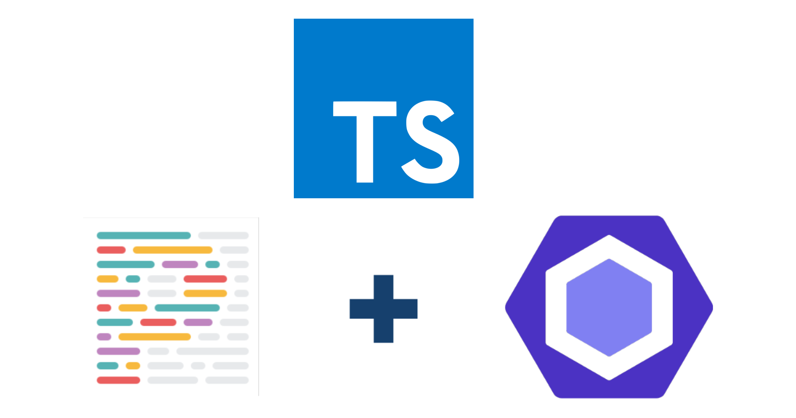

# TypeScript + ESLint + Prettier + Husky with Jest. 

You can use this template to build a new project or to practice Katas.

This template includes:
* TypeScript 4.1.2
* ESLint 7.15.0
* Prettier 2.2.1
* Husky 4.3.4
* Jest 26.6.3

## ESLint rules
[TypeScript ESLint Rules](https://github.com/typescript-eslint/typescript-eslint/tree/master/packages/eslint-plugin)

## Husky hooks
* Pre-commit: Execute npm analize (tsc + eslint --fix)
* Pre-push: Execute test

