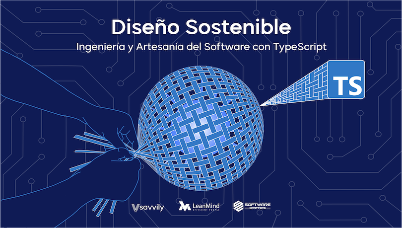

# Template - Diseño Sostenible
## Ingeniería y Artesanía del Software con TypeScript

Plantilla base para practicar las katas del curso o para empezar un proyecto nuevo.

Incluye:
* TypeScript
* Jest
* ESLint
* Prettier
* Husky

## Instrucciones
* `nvm use`
* `npm install`
* `npm test`

Más información sobre el curso en [diseñosostenible.com](https://diseñosostenible.com).

### ESLint
[TypeScript ESLint Rules](https://github.com/typescript-eslint/typescript-eslint/tree/master/packages/eslint-plugin)

### Husky hooks
* Pre-commit: Execute npm analize (tsc + eslint --fix)
* Pre-push: Execute test
